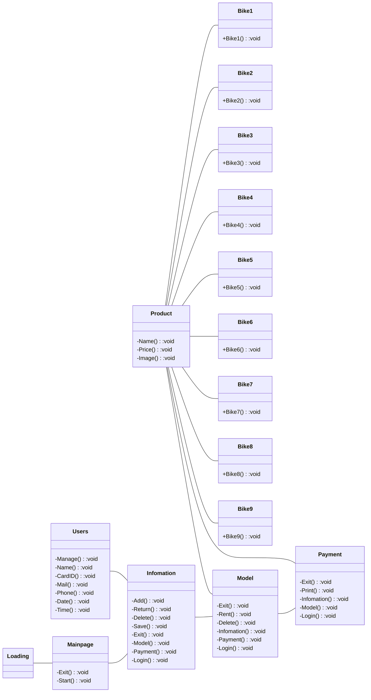

1.ความเป็นมาของโปรแกรม
```
ปัญหาคือ มีผู้คนจำนวนมากที่ต้องการเดินทางให้สะดวกสบายโดยการขับขี่จักรยานไปมหาวิทยาลัยหรือต้องการที่จะออกกำลังกายแต่ไม่มีจักรยานที่จะใช้ขับขี่ จึงออกแบบจัดทำขึ้นมาให้ยืมได้สะสวกสบายและรวดเร็วต่อการยืมจักรยาน
```
2.วัตถุประสงค์ของโปรแกรม
``` 
1) เพื่อให้ผู้ที่ต้องการขับขี่จักรยาน
2) สามารถยืมได้ง่ายสะดวกสบาย
3) มีหลากหลายรุ่นให้เลือก
4) มีการเก็บข้อมูลของผู้ยืมเพื่อที่จะนำไปต่อยอด
5) มีการออกบินค่าใช้จ่ายในการยืม
6) เพื่อให้ผู้ที่ต้องการมีสุขภาพร่างกายแข็งแรงจึงได้จัดทำขึ้น
```
3.โครงสร้างของโปรแกรม (Class diagram) ของโปรแกรม ใช้ Mermaid ในการเขียน ตัวอย่าง การเขียน Classdiagram ใน Markdown   

4.ชื่อของผู้พัฒนาโปรแกรม
```
นาย ปฏิพัทธ์ มาตรา 653450293-2
```
